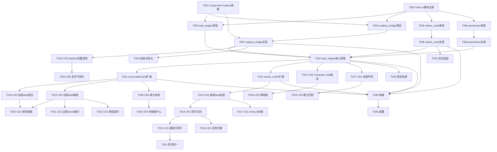

# Tasks: 硅侣Agent能力升级

**Input**: Design documents from `spec/agent-capability/`
**Prerequisites**: plan.md (required), spec.md (required for user stories)

**Organization**: Tasks are grouped by user story to enable independent implementation and testing of each story.

## Format: `[ID] [P?] [Story] Description`

- **[P]**: Can run in parallel (different files, no dependencies)
- **[Story]**: Which user story this task belongs to (e.g., US1, US2, US3, US4)
- Include exact file paths in descriptions

## Path Conventions

- 所有Rust路径相对于 `siliconmate/client/src-tauri/src/`
- 所有前端路径相对于 `siliconmate/client/src/`
- 所有spec路径相对于 `siliconmate/spec/agent-capability/`

---

## Phase 1: Setup (Shared Infrastructure)

**Purpose**: 项目依赖配置和新模块骨架

- [X] T001 在 client/src-tauri/Cargo.toml 中添加 nuphus crate 依赖：`nuphus = { path = "/Users/apple/nuphus/src" }` 及其 workspace 子依赖（desktop-api, nuphus-browser, nuphus-index），确保编译通过
- [X] T002 在 client/src-tauri/src/main.rs 中声明4个新模块：`mod task_engine; mod nuphus_bridge; mod native_cmds; mod permission;` 并注册对应 Tauri managed state
- [X] T003 [P] 创建 client/src-tauri/src/task_engine.rs 骨架：定义 TaskMessage/TaskResult/TaskRoute 数据结构，impl TaskEngine（空方法），注册5个 Tauri 命令
- [X] T004 [P] 创建 client/src-tauri/src/nuphus_bridge.rs 骨架：定义 NuphusBridge struct（含 Option<DesktopClient>），impl Default/初始化，注册4个 Tauri 命令
- [X] T005 [P] 创建 client/src-tauri/src/native_cmds.rs 骨架：定义4个 Tauri 命令签名（native_screenshot/open_app/shell_exec/read_file），macOS 实现 stub
- [X] T006 [P] 创建 client/src-tauri/src/permission.rs 骨架：定义 PermissionRule/PermissionStore 数据结构，JSON文件读写，注册3个 Tauri 命令

---

## Phase 2: Foundational (Blocking Prerequisites)

**Purpose**: 核心基础设施，所有 User Story 都依赖

**⚠️ CRITICAL**: 此阶段完成前，任何 User Story 不能开始

- [X] T007 实现 nuphus_bridge.rs 完整逻辑：NuphusBridge::new() 初始化 DesktopClient，nuphus_screenshot/nuphus_execute/nuphus_status/nuphus_ocr 四个命令连接 DesktopClient 对应方法（screenshot/mouse_click/keyboard_type/window_activate/ocr 等），处理 Nuphus 不可用时的降级（DesktopClient::new() 失败则存 None，命令返回 available=false）
- [X] T008 实现 native_cmds.rs 完整逻辑（macOS）：native_screenshot 调用 `screencapture -x /tmp/siliconmate-screenshot-{ts}.png`；native_open_app 调用 `osascript -e 'tell application "X" to activate'`；native_shell_exec 调用 `Process::Command` 执行 shell + 超时控制；native_read_file 调用 `std::fs::read_to_string`
- [X] T009 实现 permission.rs 完整逻辑：PermissionStore 从 `~/.siliconmate/permissions.json` 读写规则；permission_check 查规则返回 policy（优先精确匹配，其次通配符，最后 default_policy="ask"）；permission_set 写规则+持久化；permission_list 返回所有规则；首次运行创建默认配置
- [X] T010 实现 task_engine.rs 核心逻辑：task_execute 收到 {capability, params} → 查三层路由表 → 调 native_cmds 或 nuphus_bridge 或 agent_manager → 返回 TaskResult（含 status/data/screenshots/execution_tier/duration_ms）；路由表定义：screenshot→native→nuphus→fallback(screencapture), app.open→native→nuphus(window_activate)→fallback(open), file.read→native, shell.exec→native, ocr→ocr.rs→nuphus_ocr, feishu.send→feishu_output, clipboard.*→nuphus；串行任务队列（Mutex<bool> is_processing）
- [X] T011 扩展 smcp.rs 支持 task/result 消息类型：在 SmcpMessage 的 type 字段扩展 "task"/"result"；message_poll 中检测 type: "task" 消息时调用 task_engine.task_execute（本地自动执行）；新增 smcp_task_send 命令（发送 task 给好友，type: "task"）；新增 smcp_task_result_send 命令（发送 result 给发起方，type: "result"）；task 消息不进入聊天 UI，交给 task_engine 处理
- [X] T012 扩展 scene_router.rs 支持 task 路由：新增 RouteTarget::TaskRoute { capability } 变体；当消息包含 task 关键词（截屏/截图/打开/读取/执行/发到飞书等）时路由到 TaskRoute；新增 task 意图识别：关键词优先匹配（截屏→screenshot, 打开X→app.open, 读文件→file.read, 执行→shell.exec, 识别文字→ocr, 发飞书→feishu.send）

**Checkpoint**: 基础设施就绪 —— task协议、三层路由、Nuphus桥接、原生直通、权限审批全部可用

---

## Phase 3: User Story 1 - 一句话操控本机 (Priority: P1) 🎯 MVP

**Goal**: 用户在硅侣对话中输入"截屏"，硅侣自动执行并展示结果

**Independent Test**: macOS 硅侣对话中输入"截屏"，验证截图出现在对话中，带⚡图标

### Implementation for User Story 1

- [X] T013 [US1] 前端 chat.tsx 新增 task 消息处理：监听 Tauri 事件 `task-result`，收到 TaskResult 时创建特殊消息（role: "assistant"，附带 tier/status/screenshots/duration_ms），按 tier 渲染不同样式（⚡绿色/🤖蓝色/🧠紫色/⚠️橙色边框+图标）
- [X] T014 [US1] 前端 chat.tsx 新增 Agent 指令识别：用户输入匹配"截屏/截图"时，调用 `invoke("task_execute", { capability: "screenshot", params: {} })`；匹配"打开X"时，调用 `invoke("task_execute", { capability: "app.open", params: { app_name: "X" } })`；匹配"读文件X"时，调用 `invoke("task_execute", { capability: "file.read", params: { path: "X" } })`；匹配"执行X"时，调用 `invoke("task_execute", { capability: "shell.exec", params: { command: "X" } })`
- [X] T015 [US1] task_engine.rs 实现截图结果可视化：screenshot 执行后读取截图文件，转 base64 嵌入 TaskResult.screenshots；前端收到 screenshots 时渲染为  标签；Nuphus 截屏降级链：Nuphus DesktopClient.screenshot → native_cmds screencapture → 错误回传
- [X] T016 [US1] task_engine.rs 实现高危操作拦截：shell_exec 命令检查黑名单（rm -rf /, format, mkfs, dd if=, 发短信相关），命中则返回 TaskResult { status: "error", error_message: "高危操作需界面确认" }；前端展示确认弹窗（暂不实现二次确认UI，仅阻止）
- [X] T017 [US1] 前端 smcp.ts 新增 task_execute 调用封装：`taskExecute(capability, params)` 调用 Tauri 命令，返回 TaskResult；chat.tsx 中替换直接 invoke 为 smcp.ts 封装

**Checkpoint**: macOS 硅侣对话中"截屏"→截图出现→⚡图标绿色边框；"打开Finder"→Finder弹出→🤖图标蓝色边框

---

## Phase 4: User Story 2 - 远程派任务 (Priority: P2)

**Goal**: A 对硅侣说"让pantom帮我截屏"，pantom 的硅侣自动执行并回传结果

**Independent Test**: 两个硅侣账号互为好友，一方发送截屏任务，另一方自动执行并回传截图

### Implementation for User Story 2

- [X] T018 [US2] smcp.rs 实现远程 task 发送：smcp_task_send 命令构造 SmcpMessage { type: "task", method: "task.execute", params: { task_id, capability, params, from } }，通过 message_send 发送给好友；前端 chat.tsx 识别"让X帮我Y"指令→调用 smcp_task_send
- [X] T019 [US2] smcp.rs 实现远程 task 接收与自动执行：message_poll 收到 type: "task" 消息时，解析 capability/params，调用 permission_check 判断策略；allow→直接调用 task_execute；ask→Tauri emit 事件触发前端审批弹窗；deny→直接返回 rejected；执行完成后构造 SmcpMessage { type: "result" } 回传
- [X] T020 [US2] 前端 App.tsx 实现远程任务审批弹窗：监听 Tauri 事件 `task-approval-request`，弹窗显示"来自pantom的截屏请求"，三个按钮"始终允许/本次允许/拒绝"；点击后调用 permission_set 更新策略 + 触发执行/拒绝
- [X] T021 [US2] smcp.rs 实现远程 result 接收与展示：message_poll 收到 type: "result" 消息时，Tauri emit 事件 `remote-task-result`；前端 chat.tsx 监听并渲染远程结果消息（带来源好友名+执行耗时）
- [X] T022 [US2] task_engine.rs 实现远程 task 审批超时：task 执行时启动 30 分钟超时计时器，超时自动回传 TaskResult { status: "timeout" }；前端展示"等待审批中..."状态

**Checkpoint**: A发"让pantom截屏"→pantom端弹审批→同意→截图回传A→A看到截图+来源信息

---

## Phase 5: User Story 3 - 本机App操控 (Priority: P3)

**Goal**: 用户说"打开微信"或"给张三发微信说你好"，硅侣通过Nuphus完成操控

**Independent Test**: macOS说"打开Finder"，Finder弹出；说"给张三发微信你好"，Nuphus执行多步操作并截图记录

### Implementation for User Story 3

- [X] T023 [US3] nuphus_bridge.rs 实现完整 Computer Use 调用链：nuphus_execute 支持调用 DesktopClient 全部28个方法（mouse_click/keyboard_type/window_activate/clipboard_write/screenshot/ocr/perceive/find_text等），参数透传，结果转 Value 返回
- [X] T024 [US3] task_engine.rs 扩展 Computer Use 能力路由：capability "computer.use" 触发 Nuphus 完整执行；复杂指令（如"给张三发微信说你好"）由 agent_manager 调用 free-code 拆解为 Nuphus 操作序列；task_execute 支持 multi-step 执行（步骤间截图记录）
- [X] T025 [US3] 前端 chat.tsx 实现多步执行可视化：Computer Use 执行过程中，每步截图通过 Tauri 事件 `task-step` 实时推送到前端，展示为折叠的操作步骤列表（步骤1: 打开微信→截图，步骤2: 搜索张三→截图，步骤3: 发送消息→截图）
- [X] T026 [US3] task_engine.rs 实现 Nuphus 降级链完善：Nuphus 不可用时，app.open 降级 osascript，screenshot 降级 screencapture，clipboard 降级 pbcopy/pbpaste，其余能力返回 "Nuphus不可用，无法执行"

**Checkpoint**: "打开Finder"→Nuphus window_activate→Finder弹出；"给张三发微信你好"→多步执行+每步截图展示

---

## Phase 6: User Story 4 - 技能声明与发现 (Priority: P3)

**Goal**: 硅侣注册时声明能力，好友可查看，任务只投递给有能力的硅侣

**Independent Test**: 两个硅侣互为好友，一方查看另一方能力列表，确认正确

### Implementation for User Story 4

- [X] T027 [US4] smcp.rs 实现技能声明：注册时（smcp_register）新增 capabilities 字段，自动收集本机能力（原生直通4个 + Nuphus可用方法 + 已有OCR/飞书/Office等），构造 SkillDeclaration 发送给 relay
- [X] T028 [US4] smcp.rs 实现能力查询：新增 smcp_friend_capabilities 命令，查询好友的 SkillDeclaration；前端 sidebar.tsx 好友详情中展示能力列表（⚡秒级/🤖需模型 分组）
- [X] T029 [US4] task_engine.rs 实现能力匹配投递：发送远程 task 前，先查询目标好友是否有对应 capability，无则直接返回"对方不支持此操作"；receiver 收到 task 后二次校验本机能力，不匹配则返回 error
- [X] T030 [US4] 前端 chat.tsx 实现"你能做什么"指令：匹配"你能做什么/你会什么/列出能力"→调用 task_list_capabilities→渲染能力列表（⚡原生直通/🤖Nuphus/🧠深度思考 三组）

**Checkpoint**: A查看B的能力→看到screenshot/file.read/app.open等→发送截屏任务→确认B有截屏能力→正常执行

---

## Phase 7: Polish & Cross-Cutting Concerns

**Purpose**: 跨 User Story 的改进和优化

- [X] T031 [P] 前端 Agent 消息样式统一：在 chat.tsx 中定义 AgentMessage 组件，根据 tier (native/nuphus/freecode/fallback) 渲染不同图标+边框色+耗时标签，替代内联样式
- [X] T032 [P] task_engine.rs 错误处理完善：所有 task 执行路径统一返回 TaskResult，Nuphus 初始化失败/命令执行超时/权限不足/文件不存在 等场景均返回明确错误信息
- [X] T033 [P] native_cmds.rs 安全加固：shell_exec 白名单模式可选（只允许安全命令列表），read_file 限制路径范围（禁止读取 /etc/shadow 等敏感文件），高危操作黑名单独立配置文件
- [X] T034 [P] nuphus_bridge.rs 连接池优化：DesktopClient 实例懒初始化（首次调用时创建而非启动时），避免启动慢；YOLO 模型加载失败时降级为无图标的 DesktopClient

---

## Phase 8: Verification

<!-- verification_scope: build-only -->

**Purpose**: 构建验证和部署

- [X] T035 使用 `npx tauri build` 构建 macOS 版本，修复所有编译错误（特别注意 nuphus crate 依赖引入可能导致的版本冲突：xcap/tokio/reqwest/image 版本对齐）
- [X] T036 部署构建产物到本机测试（macOS DMG 安装验证）

---

## 📊 Dependency Graph



## ⚡ Parallel Execution Guide

| Phase | Tasks | Required Files | Execution Notes |
|-------|-------|---------------|-----------------|
| Setup | T003, T004, T005, T006 | task_engine.rs, nuphus_bridge.rs, native_cmds.rs, permission.rs | 4个骨架文件互不依赖，可并行 |
| Foundational | T007, T008, T009 | nuphus_bridge.rs, native_cmds.rs, permission.rs | 3个实现互不依赖，可并行 |
| US1 | T013, T017 | chat.tsx, smcp.ts | 前端文件可并行修改 |
| US2 | T018, T021 | smcp.rs | 同文件，需串行 |
| US3 | T023, T026 | nuphus_bridge.rs, task_engine.rs | 不同文件，可并行 |
| US4 | T027, T028 | smcp.rs | 同文件，需串行 |
| Polish | T031, T032, T033, T034 | 不同文件 | 全部可并行 |

## Dependencies & Execution Order

### Phase Dependencies

- **Setup (Phase 1)**: No dependencies - can start immediately
- **Foundational (Phase 2)**: Depends on Setup completion - BLOCKS all user stories
- **User Stories (Phase 3-6)**: All depend on Foundational phase completion
  - US1 (P1) → can start after Foundational, no cross-story deps
  - US2 (P2) → depends on US1's task_engine+smcp extension, but independently testable
  - US3 (P3) → depends on US1's nuphus_bridge, but independently testable
  - US4 (P3) → depends on US2's smcp task protocol, but independently testable
- **Polish (Phase 7)**: Depends on all desired user stories being complete
- **Verification (Phase 8)**: Depends on all implementation being complete

### User Story Dependencies

- **US1 (P1)**: Can start after Foundational - No dependencies on other stories
- **US2 (P2)**: Builds on US1's task_engine+smcp foundation, but independently testable
- **US3 (P3)**: Builds on US1's nuphus_bridge, but independently testable
- **US4 (P3)**: Builds on US2's smcp task protocol, but independently testable

### Within Each User Story

- Data structures before execution logic
- Execution logic before frontend integration
- Frontend rendering before visual polish
- Story complete before moving to next priority

### Parallel Opportunities

- All Setup tasks marked [P] can run in parallel (T003-T006)
- All Foundational tasks marked [P] can run in parallel (T007-T009)
- US1 T013 and T017 can run in parallel (different frontend files)
- US3 T023 and T026 can run in parallel (different Rust files)
- All Polish tasks (T031-T034) can run in parallel

---

## Parallel Example: Setup Phase

```bash
# Launch all skeleton files together:
Task: "Create task_engine.rs skeleton in client/src-tauri/src/task_engine.rs"
Task: "Create nuphus_bridge.rs skeleton in client/src-tauri/src/nuphus_bridge.rs"
Task: "Create native_cmds.rs skeleton in client/src-tauri/src/native_cmds.rs"
Task: "Create permission.rs skeleton in client/src-tauri/src/permission.rs"
```

## Parallel Example: Foundational Phase

```bash
# Launch all implementations together (different files, no deps):
Task: "Implement nuphus_bridge.rs full logic in client/src-tauri/src/nuphus_bridge.rs"
Task: "Implement native_cmds.rs full logic in client/src-tauri/src/native_cmds.rs"
Task: "Implement permission.rs full logic in client/src-tauri/src/permission.rs"
```

---

## Implementation Strategy

### MVP First (User Story 1 Only)

1. Complete Phase 1: Setup (6 tasks)
2. Complete Phase 2: Foundational (6 tasks) - CRITICAL, blocks everything
3. Complete Phase 3: User Story 1 (5 tasks)
4. **STOP and VALIDATE**: macOS上测试"截屏"→截图出现
5. Deploy if ready

### Incremental Delivery

1. Complete Setup + Foundational → Foundation ready
2. Add US1 → "截屏"→截图出现 → MVP! 
3. Add US2 → 远程派任务 → 硅侣互联
4. Add US3 → App操控 → 完整Computer Use
5. Add US4 → 技能声明 → 自动发现
6. Each story adds value without breaking previous stories

### Key Risk Mitigation

- **nuphus crate 依赖冲突**: T035构建时重点关注 xcap/tokio/reqwest/image 版本对齐
- **Nuphus DesktopClient 初始化慢**: T034 懒初始化优化
- **macOS 权限问题**: screencapture/osascript 需要辅助功能权限，T008 中加入权限检测提示

---

## Notes

- [P] tasks = different files, no dependencies
- [Story] label maps task to specific user story for traceability
- Each user story should be independently completable and testable
- Commit after each task or logical group
- Stop at any checkpoint to validate story independently
- **macOS-first**: 所有实现先验证 macOS，后续再移植 Linux/Windows/Android
- **nuphus crate 路径**: `/Users/apple/nuphus/src` 是本机路径，CI环境需调整
- **build命令必须用 `npx tauri build`**，禁止 `cargo build --release`（会导致白屏）

---

## Summary

- **Total tasks**: 36
- **US1 (MVP)**: 5 tasks (T013-T017)
- **US2**: 5 tasks (T018-T022)
- **US3**: 4 tasks (T023-T026)
- **US4**: 4 tasks (T027-T030)
- **Setup**: 6 tasks (T001-T006)
- **Foundational**: 6 tasks (T007-T012)
- **Polish**: 4 tasks (T031-T034)
- **Verification**: 2 tasks (T035-T036)
- **MVP scope**: Phase 1 + Phase 2 + US1 = 17 tasks
- **Key risk**: nuphus crate 依赖版本冲突（xcap/tokio/reqwest/image 需对齐），T035 构建时需重点关注
