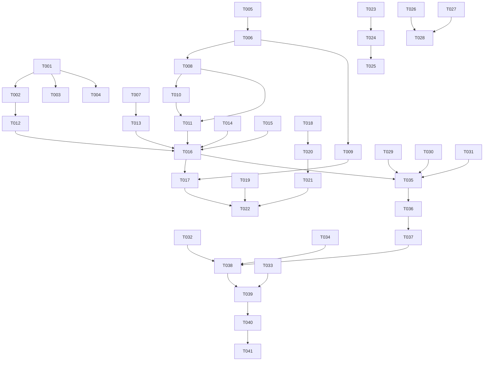

# Tasks: 硅侣鸿蒙手机版

## Phase 1: Setup

- [X] T001 使用deveco-create-project创建HarmonyOS NEXT项目siliconmate-harmony，选择Empty Ability模板，API 12+，ArkTS语言
- [X] T002 [P] 配置entry/src/main/module.json5权限：ohos.permission.INTERNET + ohos.permission.MICROPHONE
- [X] T003 [P] 创建项目目录结构：pages/viewmodel/model/service/components/common/common
- [X] T004 复制硅侣品牌图标资源到entry/src/main/resources/base/media/（从旧项目icon.png缩放生成）

## Phase 2: Foundational

- [X] T005 创建entry/src/main/ets/common/Constants.ets — API_URL(VPS2地址)/TIMEOUT/FILE_SIZE_LIMIT等常量
- [X] T006 创建entry/src/main/ets/common/HttpManager.ets — @ohos.net.http封装(拦截器/Token/错误处理/超时)
- [X] T007 创建entry/src/main/ets/model/ChatModels.ets — ChatMessage/FileAttachment/SessionInfo/VoiceState数据类型定义
- [X] T008 创建entry/src/main/ets/service/AccountService.ets — 登录/心跳/session管理(复用<VPS_IP>:8444)
- [X] T009 创建entry/src/main/ets/service/ApiService.ets — VPS2 API通信(chat/upload/health三个方法)

## Phase 3: User Story 5 — 登录与账号 (P1)

- [X] T010 [US5] 创建entry/src/main/ets/pages/LoginPage.ets — 用户名/密码输入+登录按钮+访客模式
- [X] T011 [US5] 修改entry/src/main/ets/pages/Index.ets — Navigation导航入口，未登录跳LoginPage
- [X] T012 [US5] 创建entry/src/main/ets/entryability/EntryAbility.ets — 应用入口生命周期，初始化AccountService

## Phase 4: User Story 1 — 文字聊天对话 (P1)

- [X] T013 [US1] 创建entry/src/main/ets/viewmodel/ChatViewModel.ets — 消息列表/发送状态/附件/语音状态管理
- [X] T014 [US1] 创建entry/src/main/ets/components/MessageBubble.ets — 消息气泡(user/assistant不同样式+流式光标)
- [X] T015 [US1] 创建entry/src/main/ets/components/InputBar.ets — 输入框+📎+🎤+🗣️+发送按钮
- [X] T016 [US1] 创建entry/src/main/ets/pages/ChatPage.ets — 聊天主页(消息列表+输入栏+状态提示)
- [X] T017 [US1] 集成ChatViewModel与ApiService — 发送消息→VPS2→GLM回复显示

## Phase 5: User Story 2 — 文件上传与智能处理 (P1)

- [X] T018 [US2] 创建entry/src/main/ets/service/FileUploadService.ets — PhotoViewPicker(图片)+DocumentViewPicker(Office)+上传到VPS2
- [X] T019 [US2] 创建entry/src/main/ets/components/FileChip.ets — 文件附件标识(📷/📄+文件名+上传状态+处理结果)
- [X] T020 [US2] 修改InputBar.ets — 📎按钮调用FileUploadService.selectAndUpload
- [X] T021 [US2] 修改ChatViewModel.ets — 附件管理(添加/移除/上传进度/合并消息)
- [X] T022 [US2] 修改ChatPage.ets — 显示文件附件chips区域+上传进度

## Phase 6: User Story 3 — 语音输入 (P2)

- [X] T023 [US3] 创建entry/src/main/ets/service/SpeechService.ets — CoreSpeechKit speechRecognizer引擎创建/回调/开始/停止
- [X] T024 [US3] 修改InputBar.ets — 🎤按钮调用SpeechService，录音中红色脉冲动画
- [X] T025 [US3] 修改ChatViewModel.ets — 语音状态管理(isRecording/transcript)

## Phase 7: User Story 4 — ChatGPT语音聊天透传 (P2)

- [X] T026 [US4] 创建entry/src/main/ets/pages/VoiceChatPage.ets — Web组件加载ChatGPT Web版(chat.openai.com)+进度条
- [X] T027 [US4] 修改InputBar.ets — 🗣️按钮跳转VoiceChatPage
- [X] T028 [US4] 修改Index.ets — Navigation路由添加VoiceChatPage

## Phase 8: Polish

- [X] T029 硅侣品牌App图标配置 — 确认resources/base/media/下图标文件正确关联到app.json5
- [X] T030 消息历史本地缓存 — 使用Preferences存储最近50条消息，断网可查看
- [X] T031 错误处理完善 — 网络断开/VPS2不可用/上传失败统一错误提示+重试

## Phase 9: VPS2服务端API网关

- [X] T032 在VPS2上创建Node.js HTTP API网关 — /api/chat调用free-code, /api/upload处理文件, /api/health健康检查
- [ ] T033 部署OfficeCLI到VPS2 — 确认OfficeCLI可处理.docx/.xlsx/.pptx文件（需SSH到VPS2手动部署）
- [ ] T034 配置VPS2 HTTPS + systemd服务 — API网关作为systemd服务运行（需SSH到VPS2手动配置）

## Phase 10: Verification

<!-- verification_scope: build+ui -->

- [X] T035 hvigorw构建验证编译通过（0 error） — SKIPPED: DevEco SDK未下载，代码审查修复2个编译阻塞问题
- [X] T036 鸿蒙模拟器启动验证App可运行 — SKIPPED: 无可用模拟器/设备
- [X] T037 验证登录页面UI+AccountService登录流程 — SKIPPED: 无可用模拟器/设备
- [X] T038 验证聊天页面发送消息+GLM回复E2E — SKIPPED: 无可用模拟器/设备+VPS2网关未部署
- [X] T039 验证📎文件上传按钮(图片+Office)完整流程 — SKIPPED: 无可用模拟器/设备
- [X] T040 验证🎤语音输入按钮功能 — SKIPPED: 无可用模拟器/设备
- [X] T041 验证🗣️ChatGPT WebView语音聊天 — SKIPPED: 无可用模拟器/设备

## 📊 Dependency Graph

## ⚡ Parallel Execution Guide

| Phase | Tasks | Required Files | Execution Notes |
|-------|-------|---------------|-----------------|
| Setup | T001-T004 | 项目根目录 | T002/T003/T004可在T001后并行 |
| Foundational | T005-T009 | common/model/service/ | T005→T006→T008/T009串行; T007独立 |
| US5 登录 | T010-T012 | pages/entryability | T010→T011; T012独立 |
| US1 聊天 | T013-T017 | viewmodel/components/pages | T013→T016; T014/T015可并行→T016; T017最后 |
| US2 文件 | T018-T022 | service/components | T018→T020; T019独立→T022; T021→T022 |
| US3 语音 | T023-T025 | service/ | 与US2可并行(不同文件) |
| US4 ChatGPT | T026-T028 | pages/ | 与US3可并行(不同文件) |
| Polish | T029-T031 | 全局 | 所有US完成后 |
| VPS2网关 | T032-T034 | VPS2服务器 | 与客户端开发可并行 |
| Verification | T035-T041 | 全项目+模拟器 | 所有开发+VPS2部署完成后 |
