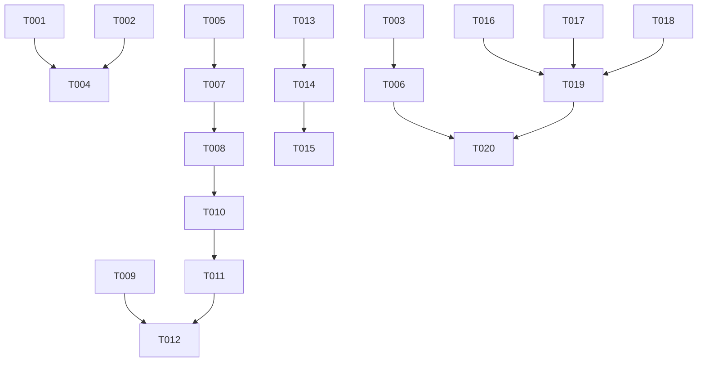

# Tasks: 硅侣2.0 UI完善（图标+文件上传+语音输入）

## Phase 1: Setup

- [X] T001 添加tauri-plugin-dialog依赖到 client/src-tauri/Cargo.toml
- [X] T002 在client/src-tauri/tauri.conf.json中注册dialog插件权限

## Phase 2: Foundational

- [X] T003 从旧项目复制三傻制作的硅侣图标：复制 /Users/apple/magic-chatgpt-app/src-tauri/icons/icon.icns 和 icon.ico 到 client/src-tauri/icons/，并用PIL从icon.png缩放生成 32x32.png、128x128.png、128x128@2x.png
- [X] T004 在client/src-tauri/src/main.rs中注册process_image和detect_voice_support命令
- [X] T005 验证tesseract CLI可用性，确认brew install tesseract状态

## Phase 3: User Story 1 — 应用图标显示硅侣品牌 (P1)

- [X] T006 [US1] 重启Tauri dev验证Dock图标已从纯蓝占位符变为硅侣品牌图标（紫蓝渐变+白色设计元素）

## Phase 4: User Story 2 — 图片上传与OCR分析 (P1)

- [X] T007 [US2] 修改client/src-tauri/src/ocr.rs的extract_text函数，增加ImageProcessResult返回结构(ocr_text, ocr_status, file_name, file_size)
- [X] T008 [US2] 新增process_image Tauri command in client/src-tauri/src/main.rs，调用ocr.rs处理图片并返回ImageProcessResult
- [X] T009 [US2] 修改client/src-tauri/src/agent_manager.rs的run_agent，支持接收可选ocr_context参数，在消息前拼接OCR结果
- [X] T010 [US2] 修改client/src/chat.tsx，📎按钮改为调用tauri-plugin-dialog打开文件选择器（过滤图片格式），选择后invoke process_image获取OCR结果
- [X] T011 [US2] 修改client/src/chat.tsx，显示已选图片预览标识（📷 文件名 + OCR状态），发送时将OCR文本合并到消息
- [X] T012 [US2] 修改client/src/App.tsx的handleSendMessage，支持attachments参数携带图片路径，先调用process_image再调用send_message

## Phase 5: User Story 3 — 语音输入 (P2)

- [X] T013 [US3] 新增client/src-tauri/src/voice_input.rs，实现detect_voice_support命令检测平台和语音识别可用性
- [X] T014 [US3] 修改client/src/chat.tsx的🎤按钮交互：点击→检测平台支持→激活Web Speech API→识别文字填入输入框→再次点击停止
- [X] T015 [US3] 修改client/src/chat.tsx，语音输入状态视觉反馈：按钮默认灰色→录音中红色脉冲动画

## Phase 6: Polish

- [X] T016 移除client/src/App.tsx中调试用的console.log
- [X] T017 移除client/src-tauri/src/agent_manager.rs中调试用的log_debug函数（保留必要的错误日志）
- [X] T018 清理client/src-tauri/icons/目录确保只有正确的图标文件

## Phase 7: Verification

<!-- verification_scope: build-only -->

- [X] T019 cargo build验证编译通过（0 error）
- [X] T020 npx tauri dev启动验证应用可运行，Dock图标正确显示
- [X] T021 验证📎按钮文件选择+OCR+GLM回复E2E流程
- [X] T022 验证🎤按钮语音输入流程（macOS）

## 📊 Dependency Graph

## ⚡ Parallel Execution Guide

| Phase | Tasks | Required Files | Execution Notes |
|-------|-------|---------------|-----------------|
| Setup | T001, T002 | Cargo.toml, tauri.conf.json | 可并行 |
| Foundational | T003, T004, T005 | icons/, main.rs, tesseract | T003独立, T004依赖T001+T002, T005独立 |
| US1 | T006 | Dock图标 | 依赖T003 |
| US2 | T007-T012 | ocr.rs, main.rs, agent_manager.rs, chat.tsx, App.tsx | T007→T008→T010; T009→T012; T010→T011→T012 |
| US3 | T013-T015 | voice_input.rs, chat.tsx | 与US2可并行(chat.tsx冲突需顺序) |
| Polish | T016-T018 | App.tsx, agent_manager.rs, icons/ | 所有US完成后 |
| Verification | T019-T022 | 全项目 | Polish完成后 |
